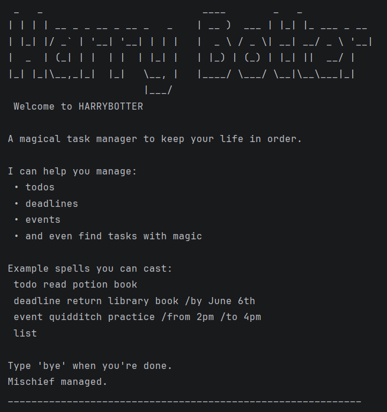

# HarryBotter User Guide



HarryBotter is a command-line task manager that helps you organize your tasks quickly and efficiently.
It supports managing ToDo tasks, Deadlines, and Events, allowing users to track their tasks from the terminal.

HarryBotter automatically saves tasks to a file, so your tasks remain available even after restarting the program.
## Adding ToDos

Type 'todo [description]'.
Adds a simple task without a date or time

Example: `todo read book`

```
Alrighty! Added: 
[T][ ] read book
Sigh Now you have 4 tasks left to complete!
```
## Adding Deadlines
Type 'deadline [description] /by [deadline].
Adds a task which has to be done by a certain date/time

Example: `deadlne read book /by 9 june`

```
Alrighty! Added: 
[D][ ] read book (by: 9 june)
Sigh Now you have 5 tasks left to complete!
```
## Adding Events

Type 'event [description] /from [start] /to [end]'-
Adds a task with a start and end date/time

Example: `event read book /from 9 june 2pm /to 9 june 3pm`

```
Alrighty! Added: 
[E][ ] read book (from: 9 june 2pm to: 9 june 3pm)
Sigh Now you have 6 tasks left to complete!
```

## List tasks

Type 'list' to return a list of all existing tasks

Example: `list`

```
Here ya go!
____________________________________________________________
1.[T][X] join sports club
____________________________________________________________
2.[D][ ] return book (by: june 6th)
```

## Search tasks

Type 'search [keyword]' to return all tasks starting with input description

Example: `find book`

```
Searching.... 
____________________________________________________________
1.[D][ ] return book (by: june 6th)
```

## Delete tasks

Type 'delete X' to remove task number X from the tasklist.

Example: `delete 2`

```
Sure mate, I have removed this task for you: 
 [D][ ] return book (by: june 6th)
Congrats! Now you have 5 tasks left to complete!
```

## Mark tasks as done

Type 'mark X' to mark task number X from the tasklist.

Example: `mark 1`

```
OK mate, I've marked this task as done!
[T][X] join sports club
```

## Unmark tasks as incomplete

Type 'unmark X' to unmark task number X from the tasklist. 

Example: `unmark 1`

```
OK mate, I've marked this task as not done yet:
[T][ ] join sports club
```